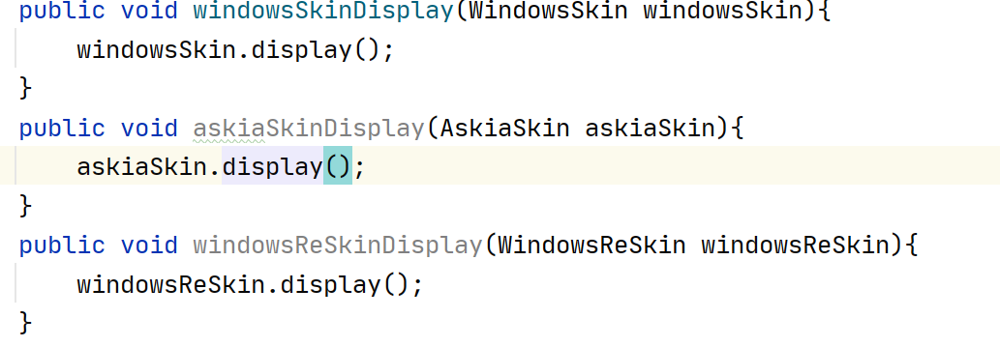
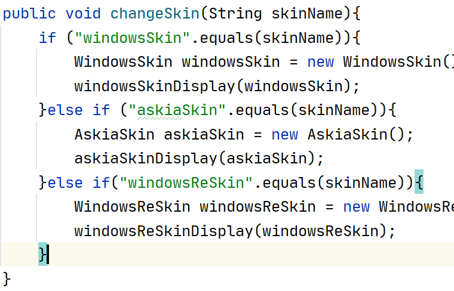
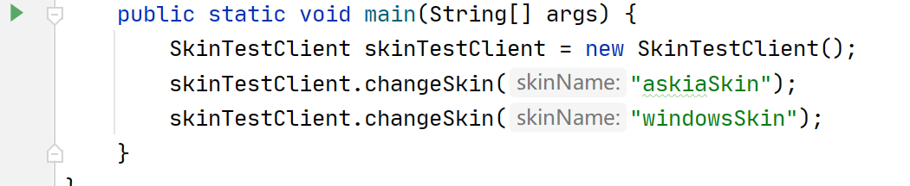

# 开闭原则

## 何为开闭原则

开闭原则（`Open Closed Principle`），**意思是对扩展开放，对修改关闭**。旨在程序需要进行扩展的时候，不能去修改原有的代码，实现一个热拔插的效果。使程序的扩展性好，易于维护和升级。

通过扩展新的实现类的方式来进行修是开闭原则实现的一种方法，在更加高阶的应用中，如热替换、热部署等，常常需要接口、配置文件等形式来完成。

## 开闭原则逐步求精

### 基础版本

举搜狗皮肤的案例，搜狗上有很多皮肤，当我们下载某款皮肤的时候可以进行一个皮肤的热替换，具体这个是怎么实现的呢？

首先我们一种实现方式，工程目录如下：


其中`XXXXSkin`代表各类皮肤代码，代码如下示例：

```java
public class AskiaSkin {
    public void display(){
        System.out.println("AskiaSkin皮肤");
    }
}
```

`SkinTestClient`代表搜狗输入法客户端。

```java
public class SkinTestClient {
   public void windowsSkinDisplay(WindowsSkin windowsSkin){
        windowsSkin.display();
    }
    public void askiaSkinDisplay(AskiaSkin askiaSkin){
        askiaSkin.display();
    }
    public void windowsReSkinDisplay(WindowsReSkin windowsReSkin){
        windowsReSkin.display();
    }
    public void changeSkin(String skinName){
        if ("windowsSkin".equals(skinName)){
            WindowsSkin windowsSkin = new WindowsSkin();
            windowsSkinDisplay(windowsSkin);
        }else if ("askiaSkin".equals(skinName)){
            AskiaSkin askiaSkin = new AskiaSkin();
            askiaSkinDisplay(askiaSkin);
        }else if("windowsReSkin".equals(skinName)){
            WindowsReSkin windowsReSkin = new WindowsReSkin();
            windowsReSkinDisplay(windowsReSkin);
        }
    }

    public static void main(String[] args) {
        SkinTestClient skinTestClient = new SkinTestClient();
        skinTestClient.changeSkin("askiaSkin");
        skinTestClient.changeSkin("windowsSkin");
    }
}
```

当我们需要新增一个新的皮肤的时候，比方说我们在`java`文件夹里面新增一个`RedJudgeSkin`这一个新增并不会修改已有的皮肤类代码，因此新增一个皮肤符合开闭原则，但是当我们把目光看向`SkinTestClient`的时候，他的代码问题就比较大了，大概可以分为两部分，第一部分问题出在这里：

我们在客户端**为每一个皮肤都写了一个换肤的方法**（接口），然后通过方法



做皮肤的换肤判断，然后客户端的运行过程中，只要像这样，就能达到换肤的效果。

这种实现，**问题比较大**，创建新皮肤的时候符合开闭原则没毛病，但是客户端的代码就是重灾区了**，因为现在扩展一个皮肤，你都需要额外编写一个换肤接口，同时你还需要在changeSkin()中，新增一个if分支！一旦你的皮肤越来越多，会造成SkinTestClient类代码臃肿，同时会留下非常多形式相同的代码，后期难以维护**

### 一次求精：去除客户端换肤接口

为了改进上面的代码，我么引入了`Java`中的接口，现在我们让所有皮肤类都实现顶层皮肤接口`Skin`，工程目录如下：


其中`Skin`接口有一个抽象的换肤方法：

```java
public interface Skin {
    void display();
}
```

其他皮肤类都需要实现这个接口。

// 图片继承图

在客户端代码中：

```java
public class SkinTestClient {

    public void skinDisplay(Skin skin){
        skin.display();
    }

    public void changeSkin(String skinName){
        Skin skin = new DefaultSkin();
        if ("windowsSkin".equals(skinName)){
            skin = new WindowsSkin();
        }else if ("askiaSkin".equals(skinName)){
            skin = new AskiaSkin();
        }else if("windowsReSkin".equals(skinName)){
           skin = new WindowsReSkin();
        }
        skinDisplay(skin);
    }

    public static void main(String[] args) {
        SkinTestClient skinTestClient = new SkinTestClient();
        skinTestClient.changeSkin("windowsSkin");
        skinTestClient.changeSkin("askiaSkin");
        skinTestClient.changeSkin("windowsReSkin");
    }
}
```

有了这个`Skin`接口，我们现在就**不需要每次新增一个皮肤都在客户端中写一个皮肤接口方法了**（之前代码的`windowsReSkinDisplay(WindowsReSkin windowsReSkin)`、`askiaSkinDisplay(AskiaSkin askiaSkin)`都不用写啦）。现在当我们需要扩展皮肤，时，只需要实现`Skin`接口，然后在`changeSkin()`中添加一个`if`分支，就可以了。

需要注意，本次的改进虽然让我们**避免了在客户端中去写皮肤接口方法**，减少了客户端代码的修改量，**但客户端代码仍然不符合开闭原则，问题出在changeSkin()在每次添加新皮肤的时候，都需要添加一个if分支**。这就涉及到接下来的第三次代码改进。

### 二次求精：统一changeSkin()

既然问题出在`changeSkin()`的分支上，那这个分支有什么作用呢？**他主要是用来判别参数传递过来的皮肤名，通过皮肤名来做判断，然后创建相应的对象**，讲到这里，所有的`if`都直接或者间接和皮肤名有关，也就是说和参数有关，这个方法参数会随时变化，我们写`if`也是为了判断是哪一类变化，然后根据这个变化**来创建相应的皮肤对象**。

既然如此，**如果传递过来的参数能够通过某个自己的内置的方法直接创建皮肤对象**呢？如果能够做到这一点的话`if`语句不就可以省略了嘛。那么在`Java`中哪项技术可以做到在程序运行时创建对象——反射`API`。因此，我们把方法参数数改成`Class`类型即可，具体的代码参考下面的改进：

```java
public void changeSkin2(Class<?> skinClazz) throws IllegalAccessException, InstantiationException {
    // 获取skinClazz所有继承的接口
    Class<?>[] interfaces = skinClazz.getInterfaces();
    // 防止传入Skin接口的class对象和其他对象
    if (skinClazz.getSuperclass() == null ||
            !interfaces[0].equals(Skin.class)){
        skinDisplay(new DefaultSkin());
        return;
    }
    // 反射创建皮肤对象
    Skin skin = (Skin)skinClazz.newInstance();
    // 显示皮肤
    skinDisplay(skin);
}
```

那现在`SkinTestClient`类代码变成了：

```java
public class SkinTestClient {

   	public void skinDisplay(Skin skin){
        skin.display();
    }
    
    public void changeSkin2(Class<?> skinClazz) throws IllegalAccessException, InstantiationException {
        // 获取skinClazz所有继承的接口
        Class<?>[] interfaces = skinClazz.getInterfaces();
        // 防止传入Skin接口的class对象和其他对象
        if (skinClazz.getSuperclass() == null ||
                !interfaces[0].equals(Skin.class)){
            skinDisplay(new DefaultSkin());
            return;
        }
        // 反射创建皮肤对象
        Skin skin = (Skin)skinClazz.newInstance();
        // 显示皮肤
        skinDisplay(skin);
    }

    // 模拟在皮肤更换窗口中点击按钮更换皮肤的过程
    public static void main(String[] args) throws Exception{
        SkinTestClient skinTestClient = new SkinTestClient();
        skinTestClient.changeSkin2(AskiaSkin.class);
        skinTestClient.changeSkin2(DefaultSkin.class);
    }
}

```

现在我们代码每个模块基本上都符合开闭原则了。当我们现在重新新增一个皮肤，比如新增一个`RedJudgeSkin`，我们只需要让`RedJudgeSkin`实现接口`Skin`即可，**不需要更改任何已有的代码**。需要注意，`main`方法里面的代码属于模拟窗口点击的，不属于具体的工程，只用于测试用。

###  二次求精另外一套思路：引入配置文件

二次求精的代码已经符合开闭原则的要求了，已经是完美的最简单的版本了，但是在这里还有一种能达到和二次求精一样效果的方法，并且该方法甚至能完全统一客户端代码（包括不属于客户端的，用于测试的`main`方法），这种方法就是使用配置文件。

使用配置文件有一个好处就是能够分担代码重量，让一些工作能够在代码之外的地方完成，同时，配置文件不需要编译，能够做到即时修改即时生效。

但使用配置文件缺点也很明显，使用配置文件意味着**代码中需要有专门处理配置文件的部分**，这一部分的代码并不简单，因此这种思路更加复杂，实现也比较困难。

使用配置文件，设计到外部文件监听服务（`WatchService`类）具体代码结构和类继承图如下：

// 图片继承图


